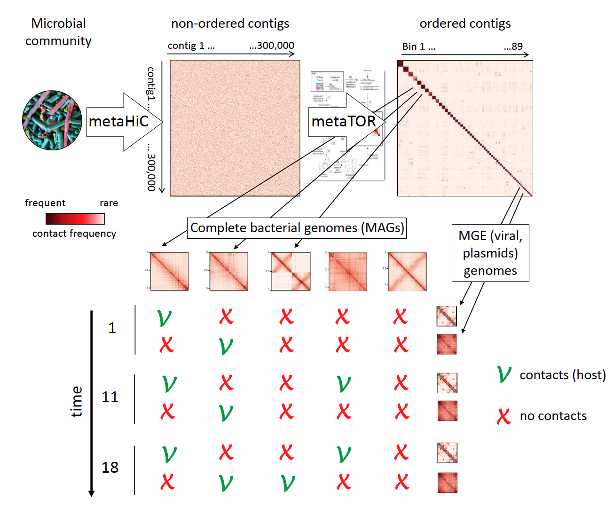

# Practical Course Meta3C




Ce TP a pour objectif de vous apprendre à analyser des séquences issues d'échantillons environnementaux. 
Nous allons partir des fichiers FastQ "brutes" en sortie directe du séquenceur et les analyser.
L'objectif est de caractériser la composition du communauté bactérienne artificielle.

Nous avons réalisé différentes banques génomiques (shotgun et 3C) à partir d'un mélange inconnu d'espèces.

Vous allez prendre le numéro de banque entre 1 et 20 correspondant à votre banque et poursuivre l'analyse.

Le TP s'organisera de la manière suivante:

- Chaque session aura son propre fichier "tuto" associé.

- Les tutoriels (ou sessions) sont construits de manière à ce que vous puissiez les faire seul sans trop de difficulté. Nous serons avec vous dans la classe pour vous aider et corriger les exercices.

NB1: chaque ligne de commande est indiquée et peut être directement copié du github vers le terminal (cf ci-dessous)

```sh
echo "ceci est une ligne de commande"
```

NB2: n'oubliez pas de répondre aux questions posées et de faire les exercices demandés tout au long du TP 

Votre cahier de TP informatique comptera dans la note finale !!!


## Planning des sessions 

* 1 - Contrôle qualité et traitement des séquences issues du séquençage
* 2 - Assemblage d’un métagénome
* 3 - Analyse d’un assemblage de métagénome
* 4 - Annotation d'un assemblage
* 5 - Binning des contigs par exploitations des interactions inter-contigs (MetaTOR)
* 6 - Analyse et validation des bins obtenus
* 7 - Session en autonomie


