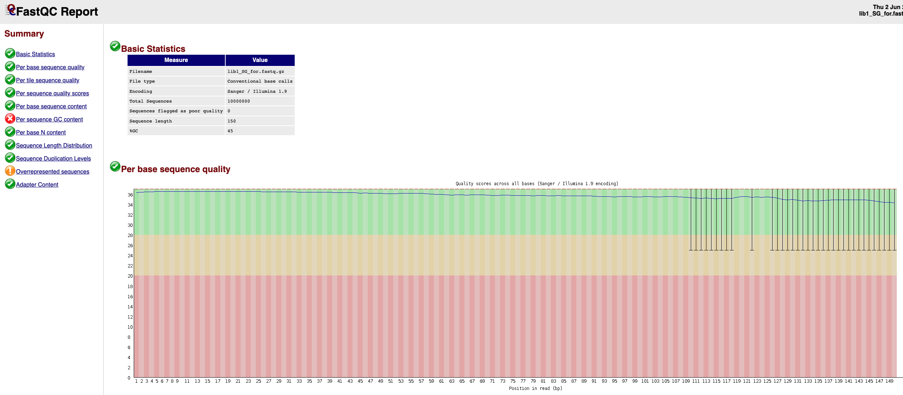

# Session 1: Contrôle qualité et traitement des séquences brutes issues du séquençage

Vous allez travailler avec 4 fichiers de sorties de séquençage : les reads en sens (forward) et en anti-sens (reverse) pour chaque banque construites (ShotGun et 3C). Vos fichiers sont nommés ainsi et se trouve sur l'espace GAIA:

* libX_SG_for.fastq.gz
* libX_SG_rev.fastq.gz
* libX_3C_for.fastq.gz
* libX_3C_rev.fastq.gz

Avant de procéder à l'analyse ou à l'exploitation d'un ensemble de données de séquençage, il est impératif de réaliser des contrôles de qualité des séquences brutes et d'appliquer des filtres si nécessaires. Cette opération permettra de s'assurer qu'il n'y a pas de problèmes cachés dans vos données initiales et de travailler avec des séquences de bonne qualité.

se placer sur le bureau de la Machine virtuelle

```sh
cd ~/Bureau/
```

créer un répertoire (l'option -p permet de créer des répertoires de manière recursive et dans des répertoires n'existant pas et évite les messages d'erreurs ... c'est parfois utile et c'est un réflexe chez moi))

```sh
mkdir -p TP_Meta3C/
```
rentrer dans le repertoire

```sh
cd  TP_Meta3C/
```

toutes les lignes de commande que vous verrez s'exécuteront depuis cet emplacement désormais !!!!

créer un répertoire pour y déposer les fichiers fastq


```sh
mkdir -p fastq/
```

choisissez au hasard parmi les 10 échantillons et copier les fichiers fastq correspondants (n'oubliez pas de changer le X !!!)

```sh
scp votrelogin@sftpcampus.pasteur.fr:/pasteur/gaia/projets/p01/Enseignements/GAIA_ENSEIGNEMENTS/AdG_2023_2024/TP_Meta/fastq/libX_* fastq/
```

pour cette séance vous aurez également besoin d'un fichier fasta contenant les séquences des adaptateurs illumina. Copier l'ensemble du dossier [database/] sur GAIA qui contient d'autre fichiers dont nous aurons besoin par la suite.

```sh
scp -r votrelogin@sftpcampus.pasteur.fr:/pasteur/gaia/projets/p01/Enseignements/GAIA_ENSEIGNEMENTS/AdG_2023_2024/TP_Meta/database/ ./
```
Nous aurons également besoin d'un répertoire plus tard... Copier l'ensemble du dossier [software/] sur GAIA.

```sh
scp -r votrelogin@sftpcampus.pasteur.fr:/pasteur/gaia/projets/p01/Enseignements/GAIA_ENSEIGNEMENTS/AdG_2023_2024/TP_Meta/software/ ./
```

C'est bon, on est prêt à commencer !!!

visualiser vos données fastq 

```sh
zcat  fastq/libX_SG_for.fastq.gz  |  head
zcat  fastq/libX_SG_rev.fastq.gz  |  head
zcat  fastq/libX_3C_for.fastq.gz  |  head
zcat  fastq/libX_3C_rev.fastq.gz  |  head
```


Qi1 : Combien de lignes un read occupe-t-il ?

Qi2 : A quoi correspond chaque ligne ?

Qi3 : Combien de reads forward et reverse avez-vous dans vos jeux de données ?

Qi4 : Quelle est la longueur des reads (SG et 3C) ?

Qi5 : Quels "Tags" sont associés à vos librairies ?

Qi6 : Quelles différences observez-vous entre les Reads SG et les Reads 3C ?


## Contrôle qualité des reads (fichier FastQ)

fastQC est un programme qui prend comme entrée un fichier FastQ et exécute une série de tests pour générer un rapport complet sur la qualité des reads et des bases à différentes positions. Le programme s’exécute en ligne de commande avec les options suivantes :

    -t : nombre de processeurs accordé au programme
    -o : répertoire de sortie
    --nogroup : option permettant d’avoir des graphiques pour chaque base et non par groupe de 5




créer un répertoire de sortie des rapports de qualité des lectures
```sh
mkdir -p fastq/rapport_qualite/
```

créer un répertoire de sortie des fichiers log
```sh
mkdir -p log_files/
```

lancer le programme FastQC (1 à 3 minutes par fichier)
```sh
/Formation_AdG/FastQC/fastqc -t 4 --nogroup -o fastq/rapport_qualite/ fastq/libX_SG_for.fastq.gz > log_files/fastqc_raw_SG_for.log 2>&1
/Formation_AdG/FastQC/fastqc -t 4 --nogroup -o fastq/rapport_qualite/ fastq/libX_3C_for.fastq.gz > log_files/fastqc_raw_3C_for.log 2>&1
```

Vous trouverez les données générées par fastQC dans le dossier [fastq/rapport_qualite/sampleX_raw_SG_for_fastqc]. Afin d'avoir accès à différentes statistiques concernant vos reads, ouvrir le fichier [fastqc_report.html] (par double clic). Ne prenez pas en compte la partie "Kmer content" qui est sujette à controverse notamment en ce qui concerne des reads issues d'un métagénome.

faire la même chose pour les reads reverse

on aurait également pu écrire une petite boucle pour faire tout cela...

```sh
for sens in for rev; do for type in SG 3C; do /Formation_AdG/FastQC/fastqc -t 4 --nogroup -o fastq/rapport_qualite/ fastq/libX_"$type"_"$sens".fastq.gz >  log_files/fastqc_raw_"$type"_"$sens".log 2>&1; done; done
```

Qi7 : En analysant et comparant les rapports de qualité, quelles différences observez vous entre vos différentes banques ? Quelle est l’enzyme que vous avez utilisée pour faire votre banque 3C ?

## Cutadapt : détection et retrait des séquences d’adaptateurs

cutadapt est un programme permettant de rechercher des séquences d’adaptateurs à l'intérieur des reads brutes afin de les retirer car elles peuvent provoquer des problèmes au moment de l'assemblage. Il permet également de filtrer les reads afin de retirer du jeu de données ceux de mauvaise qualité et/ou trop petits. Le programme s’exécute en ligne de commande avec les options suivantes :

    -a file : fichier contenant les séquences des adaptateurs forward
    -A file : fichier contenant les séquences des adaptateurs reverse
    -o : fichier de sortie FastQ forward
    -p : fichier de sortie FastQ reverse
    -q : option permettant de définir une qualité minimale
    -m : option permettant de définir une longueur minimale des reads

NB : Dans le dossier [database/] sur l'espace GAIA vous trouverez le fichier contenant les séquences des adaptateurs que nous utilisons au laboratoire.

supprimer les séquences des adaptateurs et les reads de mauvaise qualité de la librairie ShotGun (10 minutes)

```sh
cutadapt -q 20 -m 45 -j 8 -a file:database/adaptateur.fasta -A file:database/adaptateur.fasta -o fastq/libX_filtre_SG_for.fastq.gz -p fastq/libX_filtre_SG_rev.fastq.gz fastq/libX_SG_for.fastq.gz fastq/libX_SG_rev.fastq.gz > log_files/cutadapt_SG.log 2>&1
```

Petite pause peut être ? c'est un poil long ...

refaire l’analyse FastQC
```sh
/Formation_AdG/FastQC/fastqc -t 4 --nogroup -o fastq/rapport_qualite/ fastq/libX_filtre_SG_for.fastq.gz > log_files/fastqc_filter_SG_for.log 2>&1
```

Qi8 : Combien de reads avez-vous gardé après cette étape de filtration ?

Refaire la même chose pour les reads 3C (plus rapide ... 2-3 minutes).

idem on aurait pu faire une petite boucle ;)

Si vous n'avez gardé aucun reads 3C ... savez vous pourquoi ? et comment corriger cela ?

Vous avez maintenant un jeux de données permettant de poursuivre l'analyse.


