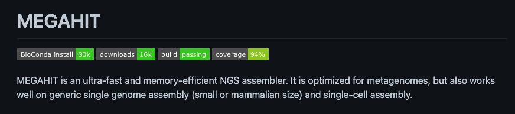

# Session 2 : Assemblage d’un métagénome

Une des opérations fondamentales en (méta)génomique est l’assemblage. Celui-ci a pour objectif de retrouver le génome original qui a été morcelé pendant la phase de séquençage. Un jeu de données génomiques est alors vu comme un énorme puzzle où les pièces sont les lectures. Deux lectures peuvent s’assembler si elles se chevauchent d’un certain nombre de nucléotides. Les lectures ainsi fusionnées forment des séquences de plus en plus longues que l’on appelle "contigs". D’un point de vue informatique, ce puzzle est généralement représenté par un graphe où les nœuds sont des séquences et où les arêtes représentent le chevauchement entre deux séquences. Les contigs sont ensuite formés en parcourant les chemins de ce graphe. En pratique, cette tâche est très complexe. Inévitablement, il existe des régions du graphe où les séquences successives se chevauchent avec plusieurs autres, forment des cycles, etc. La difficulté principale provient des grandes régions répétées du génome. Cela implique qu’une lecture peut apparaitre à plusieurs endroits du génome et possède donc plusieurs contextes. Plus le génome original contient de longues répétitions, plus il est complexe à assembler. Plus il est long, plus le nombre de lectures nécessaire est grand et plus il faut de ressources informatiques et de temps pour l’assembler. Il est donc plus simple d’assembler les lectures d’une bactérie, dont le génome est généralement court et avec peu de longues répétitions, que celles d’un humain. Il existe un large éventail d’outils d’assemblage. Ceux-ci diffèrent majoritairement par leur manière de représenter le graphe et de construire des contigs. Chaque méthode offre un compromis entre temps de calcul, quantité de mémoire requise et qualité des résultats. 

Dans le cas de la métagénomique, la différence majeure est que les échantillons sont des "soupes" composées de nombreux individus appartenant à différentes espèces pour la plupart inconnues des bases de données biologiques. Il n’est donc pas possible de savoir a priori quelles espèces ont été́ séquencées. Ainsi, en génomique, si l’assemblage est vu comme la résolution d’un puzzle contenant des millions de pièces, l’assemblage d’un jeu de données métagénomiques peut alors être vu comme la résolution d’une multitude de puzzles mélangés. Le passage à la métagénomique soulève donc de nouveaux problèmes tels que l’identification des espèces présentes, leurs quantités, leurs fonctions dans l’environnement, et requiert le développement de méthodes spécifiques.

Le but de cette partie est d’obtenir un assemblage de notre métagénome, un jeu de contigs à partir de petites lectures d’ADN. Un contig est une séquence génomique continue et ordonnée générée par l'assemblage de lectures d'ADN (lectures = reads). Les assembleurs actuels sont majoritairement basés sur des graphes de Bruijn qui modélisent la relation entre des sous-chaines exactes, extraites des fragments de séquençage. Ces assembleurs reposent sur l'identification de chevauchements exacts et sont donc particulièrement sensibles à la présence d'erreurs de séquençage.

Pour l’assemblage nous utilisons le programme megahit (il en existe beaucoup d'autres, chacun avec ses spécificités). Le logiciel megahit constitue un bon compromis entre vitesse, consommation de mémoire et performances d'assemblage. Megahit est conçu pour effectuer un assemblage métagénomique itératif rapide. L'utilisateur peut fournir différents paramètres d'assemblage et la taille des kmer itératifs. Dans notre cas, nous utiliserons les paramètres par défaut du logiciel.
Pourquoi un assemblage itératif ? Comme indiqué dans Megahit : Alors qu'une petite taille de k-mer est favorable pour filtrer les "liens" (edge of the de brujin graph) erronés et combler les trous dans les régions à faible couverture, une grande taille de k-mer est utile pour résoudre les problèmes d'assemblages dû aux répétitions.



ATTENTION: Megahit ne veut pas que le repertoire de sortie existe déjà !!!

Il s’utilise en ligne de commande avec les options suivantes :

    -1 : reads forward
    -2 : reads reverse
    -o : répertoire de sortie (créé par megahit !!!)
    -t : nombre de cpu

créer un répertoire « assemblage » . on utilisera ce repertoire pour y stocker d'autres données

```sh
mkdir -p assemblage/
```

lancer l’assemblage

```sh
/Formation_AdG/MEGAHIT/bin/megahit -t 8 -1 fastq/libX_filtre_SG_for.fastq.gz -2 fastq/libX_filtre_SG_rev.fastq.gz -o assemblage/libX/ > log_files/megahit_libX_log  2>&1
```


