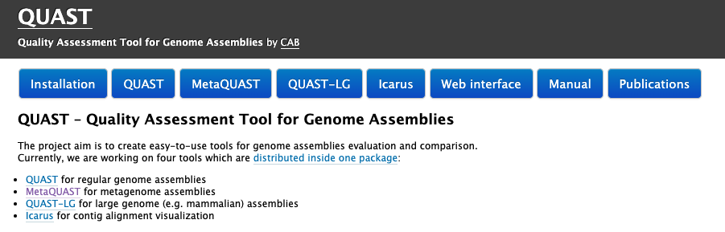

# Session 3 : Analyse d’un assemblage

Différents logiciels permettent d'analyser les résultats d'assemblage. Nous utiliserons le programme quast qui permet d'obtenir différentes statistiques sur un assemblage. Il s’utilise en ligne de commande :

explorer le répertoire de sortie de l'assemblage

```sh
ls -l assemblage/libX/
```


explorer le fichier de sortie de magahit

```sh
cat assemblage/libX/final.contigs.fa | head
```

le fichier de sortie de megahit se présente de la manière suivante:

> k77_0 flag=0 multi=7.6491 len=4919
> AAATAATACCACCAATGGCACAACCAATGTTGAAAATGGAGACAATTAAACCA....

Dans cet exemple, l'en-tête megahit fournit un nom de contig, incluant la dernière étape kmer et le numéro de contig. Ensuite, le flag indique que le contig est connecté à d'autres contigs dans le graphe d'assemblage (flag=0), non connecté (flag=1) ou circulaire (flag=2 éventuellement 3 aussi). Le multi correspond à peu près au nombre moyen de kmer. Le len correspond à la longueur du contig.

Qi9: Combien de contigs avez vous dans votre assemblage ?

Qi10: Quelle est la taille de votre plus grand contig ?

Qi11: Quelle est la taille moyenne de vos contigs ?

Qi12: Combien de contigs circulaires avez vous ?

Qi13: Combien de contigs indépendants ?


certains logiciels sont dédiés à l'analyse des assemblages. Nous allons voir l'utilisation du logiciel QUAST.



créer un répertoire de sortie des rapports d'assemblage

```sh
mkdir -p assemblage/rapport_assemblage/libX
```

lancer les statistiques d'assemblage

```sh
/Formation_AdG/quast-5.1.0rc1/quast.py assemblage/libX/final.contigs.fa -o assemblage/rapport_assemblage/libX/ > log_files/quast_libX.log 2>&1 
```

Afin d'avoir accès aux statistiques, ouvrir le fichier [report.html] (double clic).

Qi14 : Quelles sont les données fournies par Quast ?

Qi15 : Donnez une définition du N50 ?

Qi16 : Quelle est la valeur théorique du N100 ?

Nous avons également généré un assemblage issue d'un grand nombre de reads. Cet assemblage a été réalisé sur le cluster de calcul de l'Institut Pasteur car le nombre de reads est assez important et, par conséquent, les temps de calcul et les besoins en ressources également.

Copier l’assemblage dans votre répertoire assemblage/ et refaites l’analyse Quast de cet échantillon.

```sh
scp votrelogin@sftpcampus.pasteur.fr:/pasteur/gaia/projets/p01/Enseignements/GAIA_ENSEIGNEMENTS/ANALYSE_DES_GENOMES_2021-2022/TP_Meta3C/assembly/assembly_all.fa assemblage/ 
``` 

créer un répertoire de sortie 
```sh
mkdir -p assemblage/rapport_assemblage/all_lib
```

lancer les statistiques d'assemblage
```sh
/Formation_AdG/quast-5.1.0rc1/quast.py assemblage/assembly_all.fa -o assemblage/rapport_assemblage/all_lib > log_files/quast_all.log 2>&1
```

Désormais vous allez travailler sur cet assemblage.

et rassurez vous ... la pause arrive très bientot !!!
