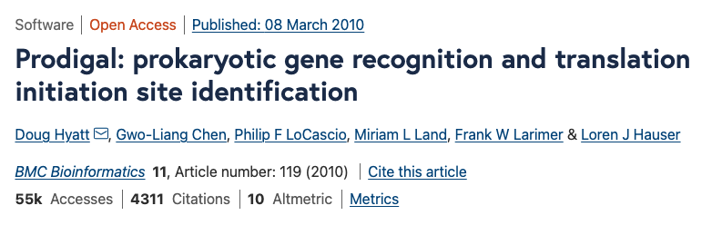
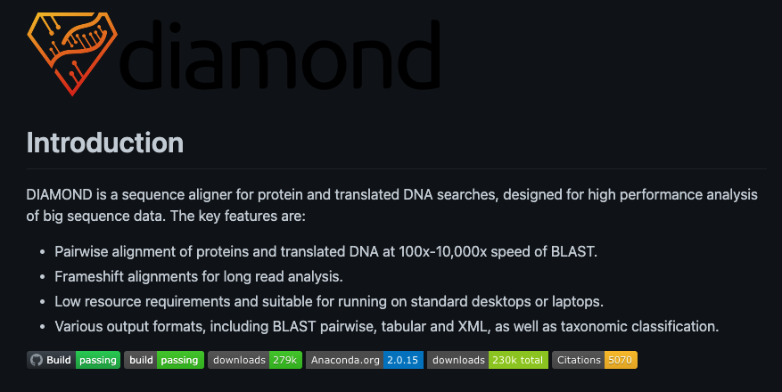
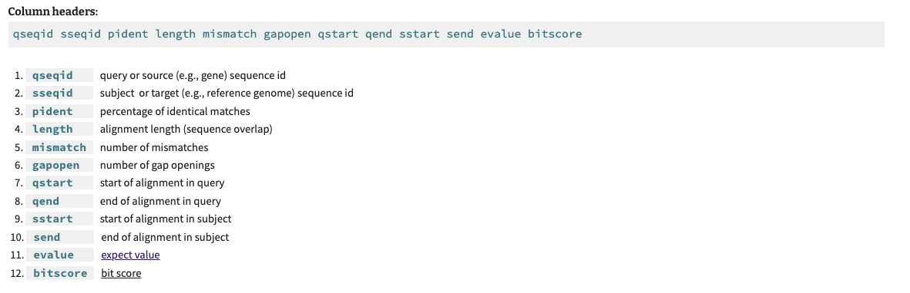
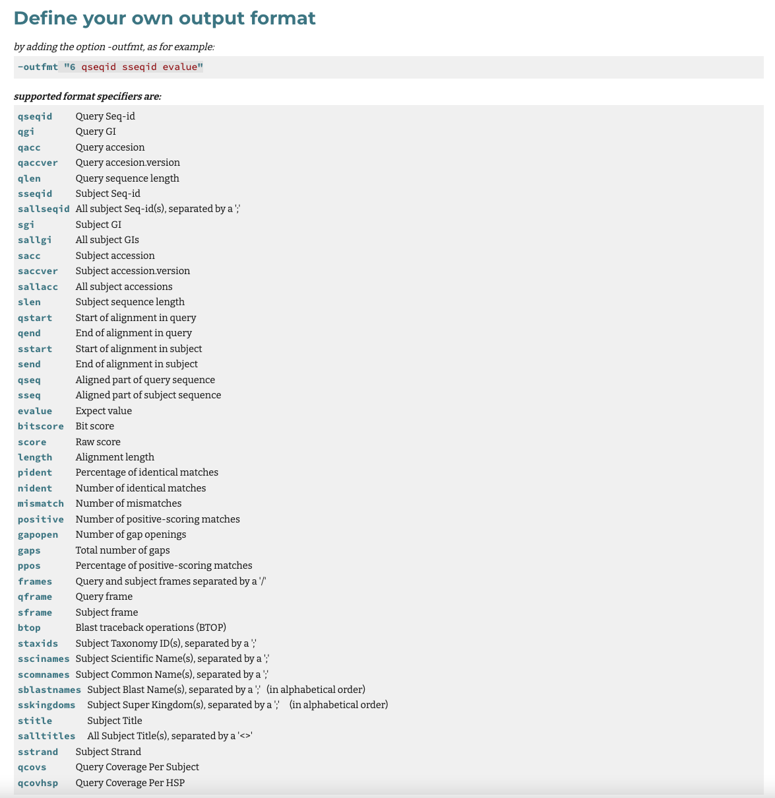
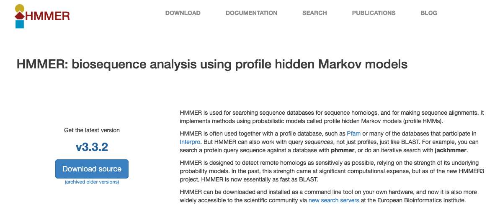
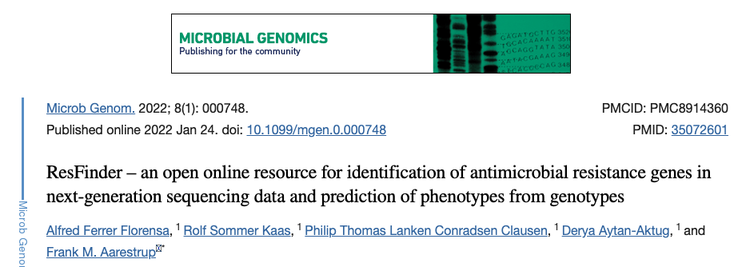

# Session 4 : Annotation d'un assemblage

L'annotation d'un métagénome a deux objectifs principaux : i - caractériser les différents organismes (annotation taxonomique); ii - caractériser les différentes fonctions (annotation fonctionnelle), présentes dans l'échantillon. L’annotation peut se faire directement au niveau des séquences d'ADN obtenues (reads), soit au niveau des contigs obtenus après assemblage, soit encore au niveau des séquences des ORFs putatives ou des séquences protéiques putatives que l'on peut détecter dans l'assemblage. L'utilisation des séquences d'ADN est plus précise mais plus difficile car les séquences d'ADN sont plus divergentes que les séquences protéiques. La première étape de l'annotation va donc consister à caractériser les ORFs putatives présentes dans notre assemblage.

vous avez récupéré l'assemblage global qui contient des contigs sous cette forme (ils ont été renommés par soucis de clarté):

NODE_XX_length_YY (length correspondant à la longueur du contig !!)

##	Recherche des phases ouvertes de lecture

Différents programmes existent pour rechercher de potentielles phases ouvertes de lecture (ORFs) (genemark, metagenemark, prodigal). Dans le cadre de ce TP nous utiliserons le programme prodigal qui est spécialisé dans la détection de gènes procaryotes à l'intérieur de génomes ou de métagénomes. En mode métagénomique, il s'entraîne directement à partir de l'échantillon métagénomique pour détecter le site d'initiation de la traduction et le code génétique alternatif (comme le genre Mycoplasma). Il peut également prédire les gènes incomplets (en 5', 3' ou des deux côtés) provenant du bord des contigs.



Ici, nous allons exécuter prodigal en mode méta, afin qu'il puisse s'adapter aux différents codes génétiques et sites d'initiation de la traduction.

Prodigal s'utilise en ligne de commande avec les options suivantes :

   -a : fichier d'output où seront écrites les séquences de protéines putatives

   -p meta : pour les métagénomes

   -o : fichier d'output où seront écrites les données sur les ORFs détectées

   -d : fichier d'output où seront écrites les séquences des ORFs putatives (ADN)

   -i : fichier d'input

créer un répertoire de sortie

```sh
mkdir -p annotations/prodigal/
```

lancer la recherche de phases ouvertes de lecture (20-30 min)

```sh
prodigal -p meta -a annotations/prodigal/assembly_prot.fa -o annotations/prodigal/assembly.gene -d annotations/prodigal/assembly_gene.fa -i  assemblage/assembly_all.fa > log_files/prodigal.log  2>&1
```

Vous avez le droit à une bonne pause de 20 min le temps que Prodigal finisse son travail !!!


Prodigal a créé deux fichiers, le fichier de protéine .faa et le fichier de gène .fna. 

Voici un exemple de sortie de gène :

>contig1_1 # 2 # 232 # -1 # ID=1_1 ; partial=10 ; start_type=ATG ; rbs_motif=None ; rbs_spacer=None ; gc_cont=0.424
ATGTTCAAGTCAGCCGTTTATTCAATTTTAGCCGCTTCTTTGGTTAATGCAGGTACCATTCCCCTCGGAA
AACTATCTGACATTGATAAAATCGGAAGCCAAACAGAGATTTTCCCATTTTTGGGTGGTTCTGGGCCATA
CTACTCTTTCCCTGGTGATTACGGTATTTCTTGACTTGCCGGAAAGTTGTGAAATGAAGCAAGTGCAA
ATGGTTGGTAGACACGGTGAA

L'en-tête Prodigal comprend : (i) le nom du contig et le numéro du gène/de la protéine, (ii) la position de départ et (iii) la position d'arrêt dans le contig, (iv) si dans le brin (+1) ou le brin complémentaire inverse (-1) (v) l'identification du gène, (vi) si partiel dans le brin gauche seulement (10), le brin droit seulement (01) ou les deux (11), (vii) le type de codon de départ, (viii) le motif du site de liaison au ribosome détecté (ix) la distance d'espacement du site de liaison au ribosome, (x) le contenu en gc.


En vous servant des fichiers obtenus et de vos connaissances Unix (et du mémo fourni), répondez aux questions suivantes :

Qi17 : Combien de gènes putatifs détectez-vous ? combien de protéines ?

Qi18 : Combien de gènes complets ? incomplets ?

Qi19 : Quelle est la longueur moyenne des gènes détectés ?

Qi20 : Quel est le plus long gène détecté ?

Qi21 : Quel est la longueur totale des gènes détectés ?

Qi22 : Quelle est la densité en séquences codantes de votre assemblage ? cette valeur vous semble-t-elle cohérente ?


## caractérisation des ORFs putatives

Différents outils existent afin de caractériser les ORFs putatives (ou protéines) présentes dans un assemblage (Principalement Blast ou HMM). Dans cette partie, nous allons rechercher un certain type de protéines impliqué dans l'organisation spatiale des génomes bactériens

### Blast (diamond)

Concernant les bases de données de blast (protéiques ou nucléiques), elles peuvent être très générales (non-redundant nucleotide database sur NCBI) ou plus spécifiques de certains groupes ou familles de gènes (marqueurs taxonomiques, phages, gènes de résistance aux antibiotiques...). Il est également possible de réaliser soi-même sa base de données. Nous allons utiliser une base de données de gènes de résistances aux antibiotiques pour rechercher ces gènes dans notre assemblage.
Pour le blast, nous utiliserons le logiciel diamond qui est une sorte de blast en beaucoup beaucoup plus rapide !!!



pour voir l'ensemble des options du logiciel diamond:

```sh
diamond help
```

création des index

```sh
diamond makedb -d database/Res_aa --in database/Res_aa.fa > log_files/blastdb_diamond.log 2>&1
```

création des répertoires de sortie

```sh
mkdir -p annotations/blast_output/
```

faire les blasts (15 minutes) 
```sh
diamond blastp -p 8 --db database/Res_diam.dmnd -o annotations/blast_output/prot_vs_AMR.txt --outfmt 6 -q annotations/prodigal/assembly_prot.fa
```

NB: le format de sortie "outfmt" est un format tabulaire donnant les infos suivantes:



Qi23 : Combien de gènes/protéines candidats obtenez vous ? 

on estime que l'on a un vrai homologue lorsque l'on a une identité d'au moins 80% sur 80% de la longueur du gène. en utlisant des options particulières de la sortie "outfmt", on peut avoir toutes les infos pour faire ce crible.



```sh
diamond blastp -p 8 --db database/Res_diam.dmnd -o annotations/blast_output/prot_vs_AMR.txt --outfmt 6 qseqid sseqid pident qcovhsp  -q annotations/prodigal/assembly_prot.fa
```

Qi24: combien de vos gènes répondent aux critères définis au dessus ?

certaines options du programme permettent également d'appliquer directement ces filtres au moment de l'alignement.

### Recherche d'homologie par "hidden Markov model" (HMM)

Un modèle de Markov caché (HMM) est un modèle statistique qui permet de modéliser une séquence cible mais en autorisant un certain degré de variabilité. Les modèles de Markov cachés sont massivement utilisés notamment en reconnaissance de formes, en intelligence artificielle, en traitement automatique du langage naturel et également pour la détection de motifs protéiques. Différents modèles sont disponibles notamment sur la base de données "Pfam" (Protein family).
Nous allons travailler avec le logiciel hmmer qui s'utilise en ligne de commande. 



création du répertoire de sortie 

```sh
mkdir -p annotations/hmm_output/
```

Pour le seuil de la recherche de motif, nous avons les deux options suivantes :

o	 -E : au niveau de la protéine entière

o 	--domE : au niveau des domaines protéiques

lancer la détection de motifs

```sh
hmmsearch  -E  0.0001  --domE  0.0001  database/Resfams.hmm  annotations/prodigal/assembly_prot.fa  >  annotations/hmm_output/prot_vs_resfam.out
```
récupérer les séquences d'intérêt
```sh
cat annotations/hmm_output/prot_vs_resfam.out  |  awk '{print $9}' |  grep  'NODE'  >  annotations/hmm_output/prot_vs_resfam.txt
```

Qi25 : Combien de candidats obtenez vous avec cette méthode ? 


### Programmes spécifiques

Il existe un grand nombre de programmes dédiés à la caractérisation de certains types d’éléments génétiques tel que les transposons, les plasmides, les phages. Ces programmes s’appuient généralement sur des séquences protéiques, des modèles HMM et d’autres spécificités des éléments étudiés pour caractériser des familles d’éléments bien spécifiques.

Recherches de gènes de type AMR : Resfinder, AMRFinder ...

Recherches de phages : VIRSorter, VIBRANT ...

Recherches de plasmides : PlasmidFinder, Plasflow, PlasX ...

Vous trouverez dans le dossier annotations/ les fichiers de sorties de différents programmes. Jetez y un oeil, vous pourrez en avoir besoin dans la suite du TP ...

copier les fichiers correspondants sur GAIA
```sh
scp votrelogin@sftpcampus.pasteur.fr:/pasteur/gaia/projets/p01/Enseignements/GAIA_ENSEIGNEMENTS/ANALYSE_DES_GENOMES_2021-2022/TP_Meta3C/annotations/*_results_table.txt annotations/
```
jetez un oeil sur les différents fichier de sortie des 3 programmes ...

concernant Resfinder:



Qi26 : Combien de gènes candidats le programme Resfinder détecte t il ? faites une comparaison avec les méthodes précédentes.


