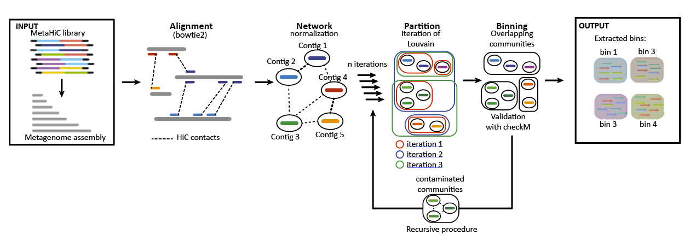
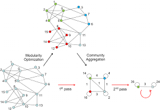

# Session 5 : Binning des contigs par exploitation des interactions inter-contigs (MetaTOR)

La métagénomique permet aujourd'hui d'étudier les micro-organismes non cultivables et ainsi d'appréhender le fonctionnement biologique de tout type d'écosystème. Néanmoins, le séquençage massif ne permet pas un inventaire exhaustif des micro-organismes et encore moins de relier la structure de la communauté et les fonctions biologiques qu'elle assure. Pour pallier cela, il est nécessaire de reconstruire les génomes complets des populations présentes. Cependant, la faible taille des séquences générées associée à la grande diversité des espèces rend l'assemblage des séquences très compliqué. Plusieurs stratégies ont été développées pour tenter de reconstruire des génomes à partir de données métagénomiques, notamment par l'utilisation du binning (cf introduction). Ces méthodes consistent à établir le profil des fragments de génomes selon leur composition en nucléotides et/ou leur abondance au sein d'un ou plusieurs métagénomes. Deux contigs aux profils similaires appartiendraient ainsi au génome d'un même organisme. La technique de Meta3C utilise, elle, les fréquences de collision entre molécules d'ADN, et donc la proximité spatiale des molécules pour regrouper les contigs au sein de "communautés". 


<p align="center">
  
</p>


## MetaTOR - Metagenomic Tridimensional Organisation-based Reassembly

Principle of MetaTOR pipeline:



if you want more described doc of MetaTOR and the different possibilities offered by the pipeline , various tutorials are available at the following links:

* package is available [here](https://github.com/koszullab/metaTOR)
* A tutorial is available [here](docs/example/metator_tutorial.md) to explain how to use metaTOR. 
* [Anvio](https://merenlab.org/software/anvio/) manual curation of the contaminated bins. Available [here](docs/example/manual_curation_of_metator_MAGs.md).
* Visualization and scaffolding of the MAGs with the contactmap modules of MetaTOR. Available [here](docs/example/MAG_visualization_and_scaffolding.md).

le programme MetaTOR offre une solution "end to end" ou "step by step" ... nous allons bien sûr suivre les étapes les unes après les autres ;) 

## Step-by-step

### Génération du réseau d’interactions inter-contig

La première étape va consister à aligner les paires de lectures des librairies 3C sur l’assemblage global afin d'établir un réseau d'interactions entre les contigs de l’assemblage. Ce réseau nous servira ensuite au regroupement (binning) des contigs. 

vous pouvez voir l'ensemble des options du logiciel avec l'option --help

```sh
metator network --help
```

```sh
metator network -n -t 4 -1 fastq/libX_filtre_3C_for.fastq.gz -2 fastq/libX_filtre_3C_rev.fastq.gz -a assemblage/assembly_all.fa -o metator_output
```

en vous servant du fichier log généré par MetaTOR ainsi que du fichier "network" généré, répondez aux questions suivantes:

Qi25 : Combien de nœuds (ou contigs) contient votre réseau global ?

Qi26 : Combien de paires de reads ont été alignées  ?

Qi27 : Combien de paires de reads ont été alignées sur deux contigs différents ?

Qi27 : déduisez en le 3D ratio (nb de reads liant 2 contigs différent par rapport au nombre total de reads alignés)

NB: il est nécessaire de ne pas prendre en compte les interactions au sein d'un même contig (intra-contig)... c'est pourquoi votre réseau ne contient pas les liens intra-contigs.

vous pouvez également faire des tests sur les différentes normalisations offertes par le programme.


### partitionnement du réseau d'interaction

la deuxième étape va consister à détecter les sous réseaux d'interactions au sein de notre grand réseau. Pour cela nous utilisons l'algorithme de Louvain

•	Algorithme de Louvain



La plupart des graphes de terrains (type de graphe mathématiques) exhibent une structure communautaire. Une communauté se définit comme un sous-graphe composé de nœuds densément reliés entre eux et faiblement liés aux autres nœuds du graphe. La méthode Meta3C est basée sur cette notion et le fait que deux séquences d'ADN appartenant à un même compartiment cellulaire auront plus fréquemment des interactions que deux séquences appartenant à deux compartiments différents. Pour la détection des "communautés de contigs" (i.e. des groupes de contigs ou bins) nous utiliserons l'algorithme de Louvain. C'est un algorithme hiérarchique qui itère sur deux étapes : 

i - Il cherche les petites communautés en optimisant la modularité de Newman et Girvan d'une manière locale. 

ii - Il fusionne les nœuds de la même communauté et construit un nouveau réseau dont les nœuds sont les communautés. La partition qui a le maximum de modularité est retenue.

Une modularité est une mesure de la qualité d'une partition des sommets (les noeuds) d'un graphe. Le principe est qu'un bon partitionnement d'un graphe implique un nombre d'arêtes (de liens) intra-communautaires important et un nombre d'arêtes inter-communautaires faible.


```sh
metator partition -h
```

nous devons d'abord indiquer au programme ou se trouve l'algorithme de louvain car il ne fait par parti stricto-senso du programme MetaTOR

```sh
export LOUVAIN_PATH=/pasteur/zeus/projets/p02/rsg_fast/Martial/gen-louvain/
```

```sh
metator partition -n -O 100 -i 1 -t 4 -n metator_output/network -c metator_output/contig_data -a assemblage/assembly_all.fa -o metator_output
```


Qi28 : Combien de bins détectez-vous ?

Qi29 : Combien de contigs ne sont associés à aucun autre (ou combien de communautés ne comprennent qu'un seul contig) ?

Qi30 : Combien de bin contiennent plus de 10 Kb, 100 Kb, 500 Kb et 1 Mb de séquences ?

Qi31 : Notez bien ces chiffres et refaites tourner l'algorithme avec les mêmes lignes de commandes (il faut mettre l'option -F afin d'écraser les fichiers existants !! ou sinon vous mettez les fichiers de sorties dans un repertoire différent ;)) Détectez-vous le même nombre de communautés que précédemment ? Ces communautés sont-elles de la même taille ?

Qi32 : Qu'en déduisez-vous ?


•	Louvain itératif

L'algorithme de Louvain est non déterministe, c'est à dire qu'en utilisant un jeu de données identiques, les résultats produits seront différents à chaque fois. Il est donc possible d'utiliser cette propriété de l'algorithme pour réaliser une sorte de "bootstraping" de notre partitionnement en communauté. Nous allons donc réaliser plusieurs itérations indépendantes de l'algorithme et de regrouper les contigs qui ségrégent toujours ensemble au cours des différentes itérations. Il est également possible de faire varier le seuil a partir duquel 2 contigs seront regroupés ensemble (overlapping communities)


Qi33 : en utilisant les scripts utilisés aujourd’hui refaites la même analyse des bins obtenus après 100 itérations de Louvain (nombre de bins, répartition en fonction de leur taille).
combien de bin entre 2 et 10Kb ? entre 10 et 100Kb ? entre 100 et 500Kb ? au dela de 500 Kb ?


Il est également possible d’analyser l’évolutions des différentes communautés en fonction du nombre d’itérations de Louvain (1, 5, 10, 20, 50, 100). A l’aide de vos connaissances, des scripts déjà utilisés et des données fournies, réaliser une analyse de l'évolution des groupes de contigs en fonction du nombre d'itérations de l'algorithme de Louvain (cf polycopié du TP)


une autre possibilité serait de changer le repertoire de sortie ;)

Qi34 : Comment évolue votre binning au cours des différentes itérations ? Combien d’itérations de louvain faudrait-il faire (justifier ce choix) ?


