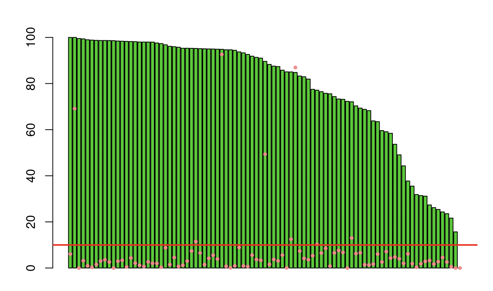
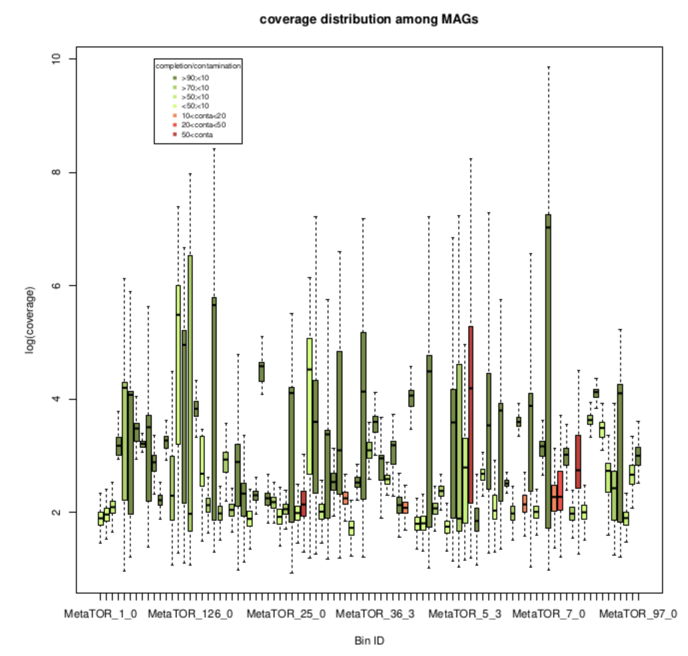

# Session 6 : Analyse et validation des bins obtenus

Différentes approches permettent de valider les bins obtenus. Nous allons essayer de passer en revue différentes méthodes permettant de valider notre binning.


##	Marqueurs taxonomiques

Différents programmes existent afin de valider les bins obtenus après partitionnement d'un métagénome (CheckM, Micomplete). Dans notre cas nous utiliserons Micomplete qui est moins complet mais beacoup moins gourmand que CheckM.

La validation des bins avec ce programme consiste à rechercher un set de gènes bactériens (via des modèles HMM), essentiels et présents en une seule copie dans plus de 97% des génomes bactériens connus.

L’absence/présence et la multiplicité de ces marqueurs permettent ainsi d’évaluer : 

i - la complétude (mesure reliée au nombre de marqueurs au sein d'un bin par rapport au nombre attendu.

ii - la contamination (mesure reliée au nombre de marqueurs en plusieurs copies).


installation de micomplete


```sh
mkdir -p binning
```

lancement de micomplete

```sh
mkdir -p binning
```

analyse des résultats

```sh
mkdir -p binning
```

Nous considèrerons un génome complet quand :

o	sa complétude se situe au-delà de 90% (>0.9)

o	sa contamination se situe en deçà de 10% (<1.1)

Qi35 : Combien de génome(s) reconstruit(s) et complet(s) avez-vous ? Quelle proportion en terme de séquence cela représente t il ?





##	Couverture et contenu en GC

Une autre façon de vérifier la qualité de nos bins est de regarder l’homogénéité de leur couverture et de leur contenu en GC.


Qi36 : graph ci-dessous à reproduire





Il est également possible de générer des « density plot » pour chaque bin afin de vérifier leur homogénéité.


pour celui là , je vais vous filer un coup de pouce ... 

lancement du script bin_analysis.sh qui prends 3 arguments en entrée [1-targeted_bin; 2-output_directory; 3-contig_data_file from MetaTOR]

ATTENTION ICI !!!!  ne recopiez pas la ligne de commande betement !! il faut remplacer targeted bin par un bin que vous souhaitez étudier et le fichier contig_data par celui correspondant aux process en question ...

> bash scripts/bin_analysis.sh  targeted_bin  figure/  output_MetaTOR/contig_data_final.txt 

##	Matrices d’interactions

A partir de n'importe quel réseau ou fichier d’alignement, il est possible de générer une matrice qui est une méthode de visualisation de graphe.

Pour cela, nous allons utiliser le script bins_matrix_generation.sh écrit en bash et qui permet de recouper les différentes informations et de générer une matrice non réordonnée et une matrice réordonnée des contigs de l’assemblage :

usage du script : bash bins_matrix_generation.sh  [fichier de sortie des données de louvain]  [fichier de l’alignement]  [dossier d’output]  [taille des pixels x 5Kb]

idem que au dessus concernant la ligne de commande !!!

vous êtes désormais (enfin j'espère) suffisamment à l'aise avec ces lignes de commandes et les arguments pour vous en sortir tout seul ;)

cela prend un peu de temps !! c'est une assez grosse matrice

attention

lancement du script :

> bash scripts/bins_matrix_generation.sh  output_MetaTOR/XX_contig_data_jesaispasquoi.txt  network/alignment_sampleXX.txt  figure/  20


