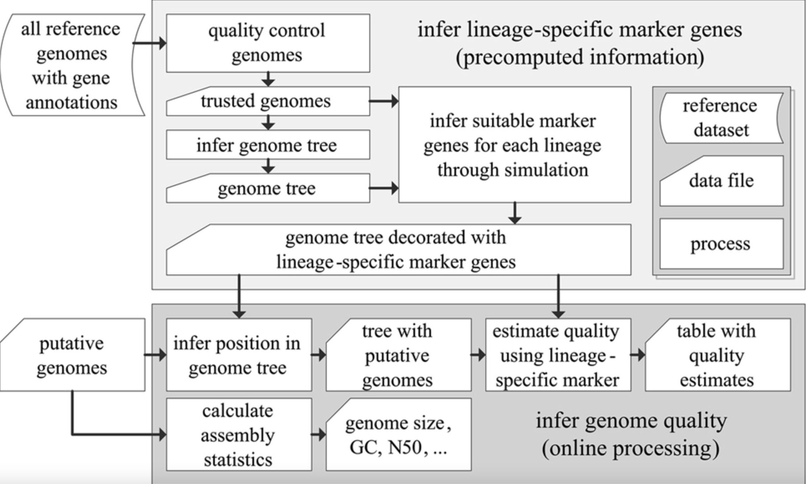
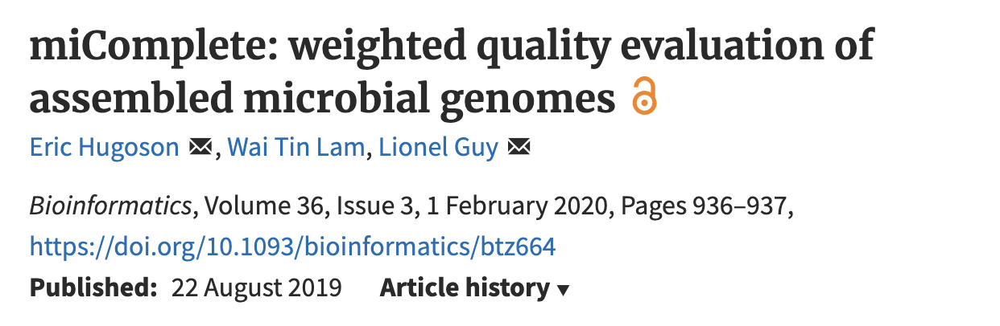
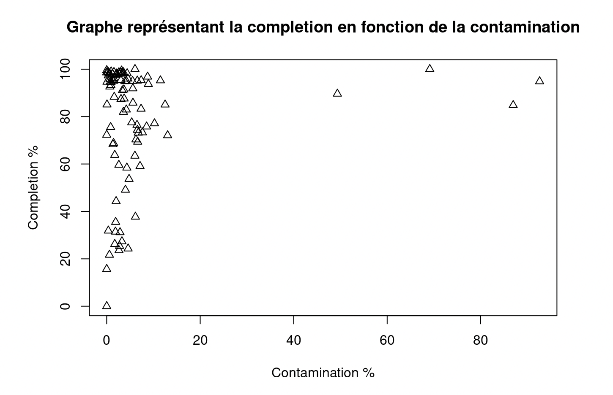
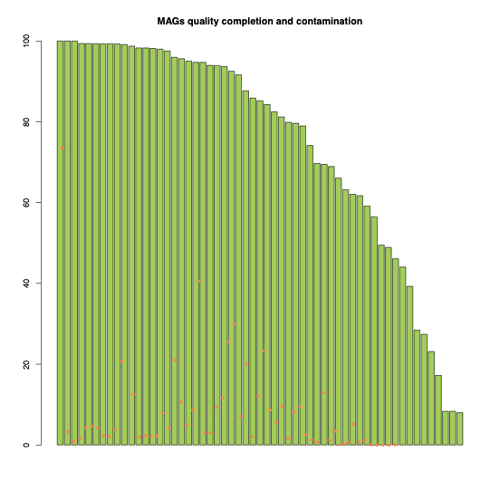
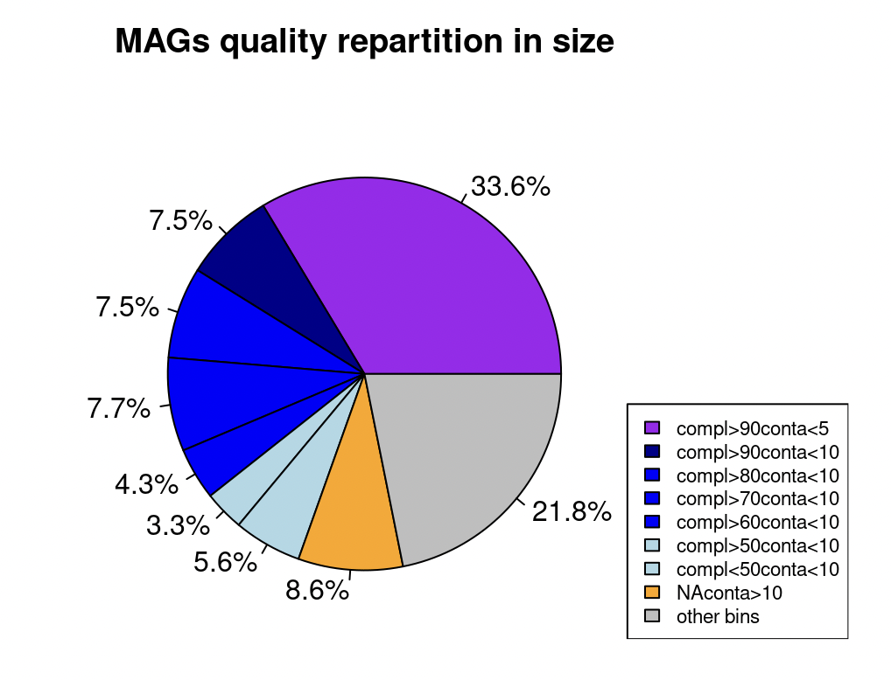
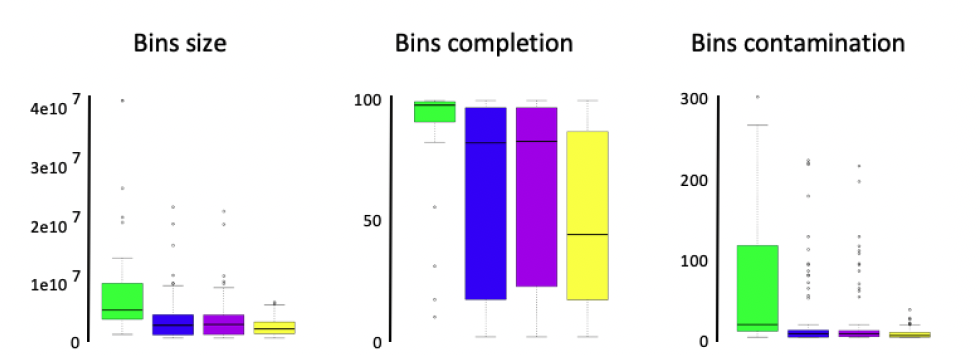

# Session 6 : Validation des bins obtenus

Différentes approches permettent de valider les bins obtenus. Nous allons essayer de passer en revue différentes méthodes permettant de valider notre binning.

Mais avant de pouvoir commencer cette session ... il va falloir installer quelques programmes et librairies !!

1- une librairie python permettant de télécharger d'autres librairies python 

```sh
curl -sSL https://bootstrap.pypa.io/get-pip.py -o get-pip.py
```

ensuite lancez la commande suivante:
```sh
python get-pip.py
```

2- des librairies python via la commande pip

```sh
~/.local/bin/pip3 install matplotlib Tk hicstuff
```

3- un package nécessaire via la commande apt-get

```sh
sudo apt-get install python3-tk
```

4- le programme micomplete

```sh
pip install micomplete
```

maintenant ... on peut commencer !!

##	Marqueurs taxonomiques



Différents programmes existent afin de valider les bins obtenus après partitionnement d'un métagénome (CheckM, Micomplete). Dans notre cas nous utiliserons Micomplete qui est moins complet mais beacoup moins gourmand que CheckM.

La validation des bins avec ce programme consiste à rechercher un set de gènes bactériens (via des modèles HMM), essentiels et présents en une seule copie dans plus de 97% des génomes bactériens connus.

L’absence/présence et la multiplicité de ces marqueurs permettent ainsi d’évaluer : 

i - la complétude (mesure reliée au nombre de marqueurs au sein d'un bin par rapport au nombre attendu.

ii - la contamination (mesure reliée au nombre de marqueurs en plusieurs copies).




pour lancer micomplete, il faut d'abord changer les extensions des bins (.fa --> .fna)

```sh
var=$(ls -l binning/metator/bins/overlapping_bin/ | sed '1d' | awk '{print $9}' | awk -F "." '{print $1}')
for i in $var; do mv binning/metator/overlapping_bin/"$i".fa binning/metator/overlapping_bin/"$i".fna; done
```

il faut ensuite construire un fichier nécessaire au fonctionnement de micomplete

```sh
find binning/metator/overlapping_bin/ -maxdepth 1 -type f -name "*.fna" | micomplete/micomplete/utils/miCompletelist.sh > binning/metator/overlapping_bin/listbins.tab
```

on peut ensuite lancer l'analyse:

```sh
micomplete/micomplete/micomplete.py binning/metator/overlapping_bin/listbins.tab --threads 8 --hmms Bact105 -o binning/metator/miComplete.txt 
```

et jeter un oeil aux résultats

```sh
cat binning/metator/miComplete.txt | head
```

Nous considèrerons un génome complet quand :

o	sa complétude se situe au-delà de 90% (>0.9)

o	sa contamination se situe en deçà de 10% (<1.1)

Qi35 : Combien de génome(s) reconstruit(s) et complet(s) avez-vous ? Quelle proportion en terme de séquence cela représente t il ?







Qi36 : faites une analyse comparative de votre binning en fonction des différentes itérations




