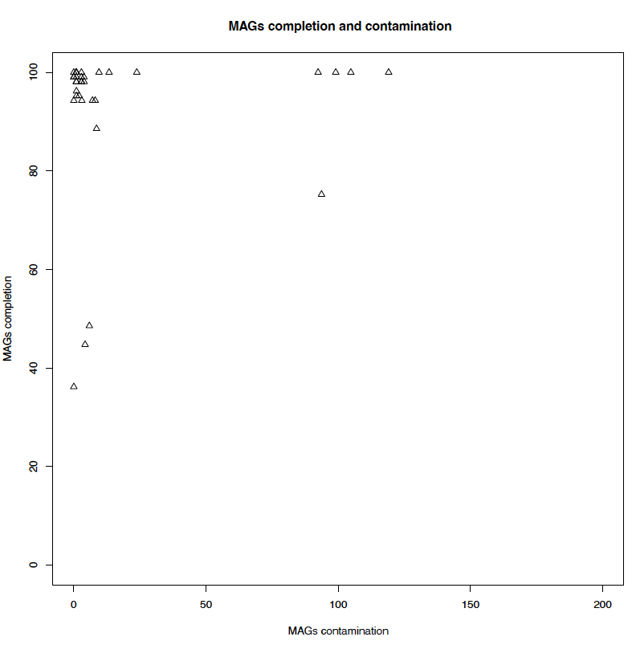
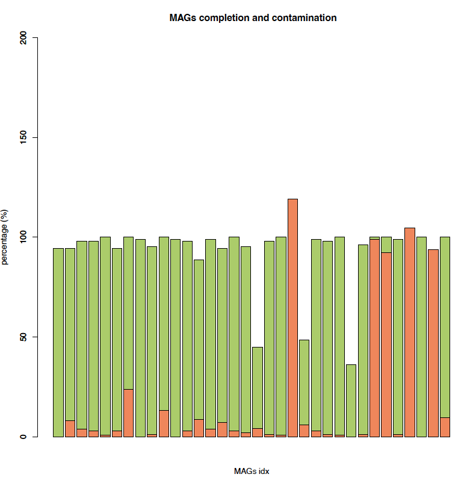
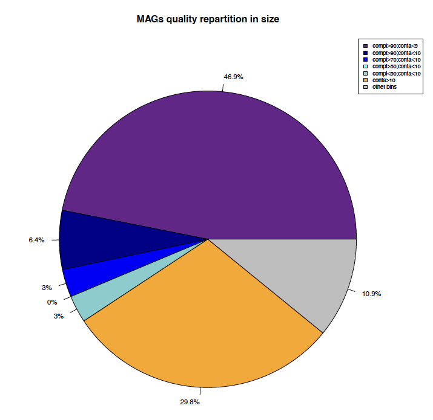

# Session 6 : Validation des bins obtenus

Différentes approches permettent de valider les bins obtenus. Nous allons essayer de passer en revue différentes méthodes permettant de valider notre binning.


##	Marqueurs taxonomiques


Différents programmes existent afin de valider les bins obtenus après partitionnement d'un métagénome (CheckM, Micomplete). Dans notre cas nous utiliserons Micomplete qui est moins complet mais beacoup moins gourmand que CheckM.

La validation des bins avec ce programme consiste à rechercher un set de gènes bactériens (via des modèles HMM), essentiels et présents en une seule copie dans plus de 97% des génomes bactériens connus.

L’absence/présence et la multiplicité de ces marqueurs permettent ainsi d’évaluer : 

i - la complétude (mesure reliée au nombre de marqueurs au sein d'un bin par rapport au nombre attendu.

ii - la contamination (mesure reliée au nombre de marqueurs en plusieurs copies).


pour lancer micomplete, il faut d'abord changer les extensions des bins (.fa --> .fna)

```sh
var=$(ls -l binning/metator/overlapping_bin/ | sed '1d' | awk '{print $9}' | awk -F "." '{print $1}')
for i in $var; do mv binning/metator/overlapping_bin/"$i".fa binning/metator/overlapping_bin/"$i".fna; done
```

il faut ensuite construire un fichier nécessaire au fonctionnement de micomplete

```sh
find binning/metator/overlapping_bin/ -maxdepth 1 -type f -name "*.fna" | ~/.local/bin/miCompletelist.sh > binning/metator/overlapping_bin/listbins.tab
```

on peut ensuite lancer l'analyse (5 - 10 min):

```sh
miComplete binning/metator/overlapping_bin/listbins.tab --threads 8 --hmms Bact105 -o binning/metator/miComplete.txt 
```

et jeter un oeil aux résultats

```sh
cat binning/metator/miComplete.txt | head
```

Nous considèrerons un génome complet quand :

o	sa complétude se situe au-delà de 90% (>0.9)

o	sa contamination se situe en deçà de 5% (<1.05)

un génome HQ (high-quality):

o	sa complétude se situe au-delà de 90% (>0.9)

o	sa contamination se situe en deçà de 10% (<1.1)

un génome MQ (medium-quality):

o	sa complétude se situe au-delà de 70% (>0.7)

o	sa contamination se situe en deçà de 10% (<1.1)

un génome LQ (low-quality):

o	sa complétude se situe au-delà de 50% (>0.5)

o	sa contamination se situe en deçà de 10% (<1.1)

un génome PQ (poor-quality):

o	sa complétude se situe en deçà de 50% (<0.5)

o	sa contamination se situe en deçà de 10% (<1.1)

un génome Contaminé:

o	sa contamination se situe au delà de 10% (>1.1)


Qi35 : Combien de génome(s) reconstruit(s) et complet(s) avez-vous ? Quelle proportion en terme de séquence cela représente t il ?








vous savez maintenant evaluer la qualité de vos bins en utilisant MiComplete... Félicitations, vous pouvez mainteant passer à la suite !!

il demeure dans votre binning des MAGs très contaminés. avez vous une idée pour décontaminer ces MAGs?

vous trouverez sur l'espace GAIA, le répertoire de sortie de MetaTOR après un cycle complet du programme, copiez le:

```sh
scp -r votrelogin@@sftpcampus.pasteur.fr:/pasteur/gaia/projets/p01/Enseignements/GAIA_ENSEIGNEMENTS/AdG_2023_2024/TP_Meta/metator_final/  binning/
```

vous pouvez explorer le repertoire de sortie:

```sh
ls -l binning/metator_final/
```

refaites tourner miComplete sur cet output et les fichiers FastA des MAGs [final_bin/] afin de répondre à la question 36 ;)

Qi36 : faites une analyse comparative de votre binning avec celui obtenu après l'étape recursive.


