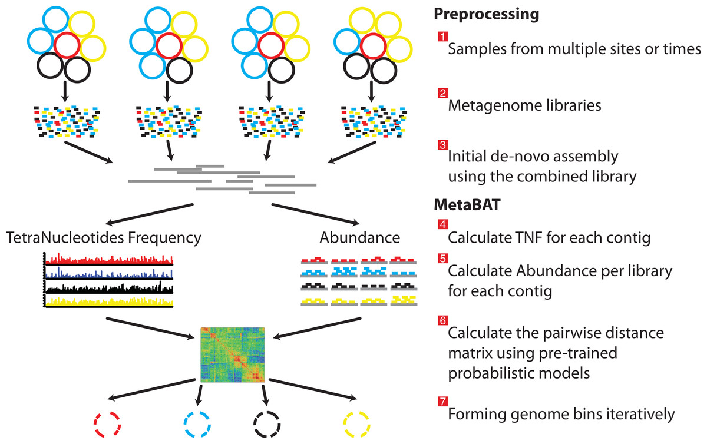

# Session 7 : Binning des contigs par couverture et fréquence de tétranucléotides (MetaBAT)

Nous allons effectuer un "binning" de nos contigs en utilisant metabat2. Metabat2 est une méthode de "binning" de contigs dites hybride  et qui est basée sur la composition des tétranucléotides de l'ADN et la covariation d'abondance. Il est normalement employé pour traiter des échantillons multiples mais cela va permettre d'apprendre à s'en servir.

Metabat2 crée un profil par contig composé de l'abondance de son kmer et de son profil d'abondance par échantillon et détermine s'il y a des contigs avec un profil similaire. La longueur minimale de contigs autorisée dans metabat2 est de 2kb, car la signature tétranucléotidique se rapproche trop du bruit avec des contigs plus courts que 2kB.



créer un répertoire de sortie pour les fichiers metabat

```sh
mkdir  -p  binning/metabat/
```

lancer MetaBAT

```sh
metabat -i assemblage/assembly_all.fa -o binning/metabat/bin_metaBAT -m 1500 -a database/cov_SG_ass.txt
```

vous avez maintenant toutes les connaissances pour regarder la qualité des bins obtenus par MetaBAT en utilisant Micomplete et réaliser une analyse comparative avec les bins obtenus via MetaTOR (vous pouvez également tester différents paramètres de MetaTOR ;) (cf ci-dessous).


