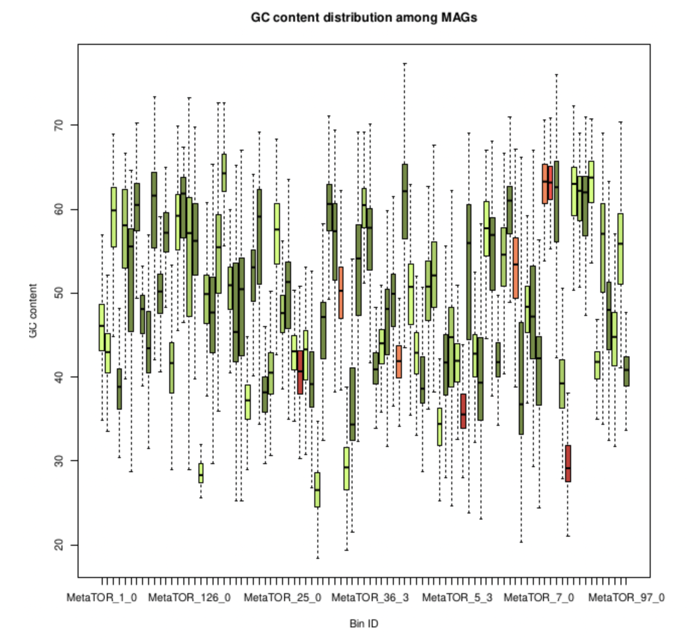

# session 7 : Analyse des bins obtenus

pour cette session, il va falloir récupérer les données que nous avons générées avec CheckM et le pipeline complet de MetaTOR (partitionnement itératif et récursif). Nous allons analyser les bins que nous avons obtenus. Pour cela, il va d'abord falloir récupérer ces données sur l'espace GAIA.

```sh
scp -r
```

vous pouvez explorer le repertoire de sortie

```sh
ls -l 
```
il contient notamment 2 fichiers conteant les résultats finaux sur les contigs et les bins obtenus:


**Contig data files**
These are the files with all the informations from the contigs:
|ID|Name|Size|GC_content|Hit|Shotgun_coverage|Restriction_site|Core_bin_ID|Core_bin_contigs|Core_bin_size|Overlapping_bin_ID|Overlapping_bin_contigs|Overlapping_bin_size|Recursive_bin_ID|Recursive_bin_contigs|Recursive_bin_size|Final_bin|
|:-:|:-:|:-:|:-:|:-:|:-:|:-:|:-:|:-:|:-:|:-:|:-:|:-:|:-:|:-:|:-:|:-:|
|1|NODE_1|642311|38.6876450815882|3837|41.1565|2006|1|65|2175226|1|396|6322353|1|52|2158803|MetaTOR_1_1|
|2|NODE_2|576356|30.235826468363303|1724|24.509|1256|2|40|1735419|2|401|735419|0|-|-|MetaTOR_2_0|
|3|NODE_3|540571|42.305266098255366|2188|14.5855|3405|3|127|6409484|3|431|13615480|1|112|6385126|MetaTOR_3_1|

**Bin summary file**
This is the summary of the data of the final bins build with all the step of metaTOR. The HiC coverage is the number of contacts (intra and inter contigs) per kilobase in the whole bin. The Shotgun coverage is the mean coverage normalized by the size of the shotgun reads from the depth file.

||lineage|completness|contamination|size|contigs|N50|longest_contig|GC|coding_density|taxonomy|Coverage|
|:-:|:-:|:-:|:-:|:-:|:-:|:-:|:-:|:-:|:-:|:-:|:-:|
|MetaTOR_8_1|o__Clostridiales|68.29|2.46|1431612|15|116129|291620|26.36|87.97|k__Bacteria;p__Firmicutes;c__Clostridia;o__Clostridiales|146.46719755483332|
|MetaTOR_8_2|o__Clostridiales|58.42|2.01|1396934|58|41290|174682|28.89|83.70|k__Bacteria;p__Firmicutes;c__Clostridia;o__Clostridiales|22.252416224710686|
|MetaTOR_8_3|o__Clostridiales|49.37|0.94|1420821|82|33095|89964|30.29|83.24|k__Bacteria;p__Firmicutes;c__Clostridia;o__Clostridiales;f__Peptostreptococcaceae_3;g__Clostridium_3|44.27369196532141|

contigs_data_final.txt & bin_summary.txt


##	Couverture et contenu en GC

Une autre façon de vérifier la qualité de nos bins est de regarder l’homogénéité de leur couverture et de leur contenu en GC.

à l'aide des données du fichier contig_data_final.txt, générez les graph ci-dessous (boxplot)




si vous avez un peu de mal ... vous pouvez jeter un oeil au script binning_analysis.sh dans le dossier scripts/.


##	analyse de bin unique

Il est également possible de générer des « density plot » pour chaque bin afin de vérifier leur homogénéité ou au contraire voir si il y a différentes populations de contigs.


pour celui là , je vais vous filer un coup de pouce ... il y a un dossier scripts/

lancement du script bin_analysis.sh qui prends 3 arguments en entrée [1-targeted_bin; 2-output_directory; 3-contig_data_file from MetaTOR]

```sh
bash scripts/bin_analysis MetaTOR_2_0 figures/ binning/metator_all/contig_data_final.txt
```

## Matrices d’interactions

A partir de n'importe quel réseau ou fichier d’alignement, il est possible de générer une matrice qui est une méthode de visualisation de graphe.

Pour cela, nous allons utiliser une fonction de notre programme MetaTOR qui permet de générer des matrices d'interactions pour différents "objets" (contig, core_bin, overlapping, bin, final_bin)

```sh
metator contactmap -h
```
on peut par exemple, 

## Répartition taxonomique des MAGs (Metagenomic Assembled Genomes)

